# Cleanup Plan - 2025-12-03 01:00:48

## Provenance
**Source STATUS**: STATUS-2025-12-03-004000.md
**Spec Reference**: CLAUDE.md (Project Architecture section)
**Generated**: 2025-12-03 01:00:48
**Agent**: status-planner

## Executive Summary

The codebase evaluation identified **~2,700 lines of dead code** across complete unused modules, deprecated installers, backup files, and fragmented test files. This cleanup plan provides a **zero-regression path** to remove all dead code while maintaining 100% test health.

**Current State** (from STATUS-2025-12-03-004000.md):
- 973/1031 tests passing (94.4% pass rate)
- 1 failing test in CLI workflows
- 4 deprecation warnings
- 57 skipped tests (5.5%)
- ~2,700 lines of verified dead code
- 98 planning documents (50+ candidates for archival)

**Target State**:
- All tests passing (974+/1031)
- Zero deprecation warnings
- -2,700+ source lines removed
- -40MB disk space freed
- Consolidated test organization
- Streamlined planning documentation

**Risk Level**: **LOW** - All removals are isolated with no production dependencies

---

## Backlog by Priority

### P0 (Critical) - Zero-Risk Module Deletions

These are complete modules with **zero production usage**, verified by import analysis in the STATUS report.

---

## P0-1: Delete Entire `src/mcpi/config/` Module

**Status**: Not Started
**Effort**: Small (1 day)
**Dependencies**: None
**Spec Reference**: CLAUDE.md §Core Modules • **STATUS Reference**: STATUS-2025-12-03-004000.md §Dead Code Analysis §1

### Description
Remove the entire `src/mcpi/config/` directory (1,748 lines) containing ConfigManager, ProfileManager, ServerStateManager, and old TemplateManager. Analysis confirms:
- **Zero imports** in production code (cli.py, clients/, templates/)
- Only imported in `conftest.py` (with try/except handling)
- Only imported in deprecated installer files (themselves unused)
- Superseded by proper implementations in `clients/manager.py` and `templates/template_manager.py`

This appears to be a **false start** - a complete module built but never integrated into the architecture.

### Acceptance Criteria
- [ ] Delete directory: `rm -rf src/mcpi/config/`
- [ ] Run test suite: `pytest --tb=short -q`
- [ ] Verify no import errors occur
- [ ] Verify test count remains stable (973+ passing)
- [ ] Check `conftest.py` - if import fails gracefully, no changes needed
- [ ] Run type check: `mypy src/` (should not introduce new errors)
- [ ] Verify CLI still works: `mcpi --help` and `mcpi list`

### Technical Notes
**Files being deleted**:
```
src/mcpi/config/
├── __init__.py                (7 lines)
├── client_manager.py          (108 lines)
├── manager.py                 (584 lines - ConfigManager, MCPIConfig, ProfileConfig)
├── profiles.py                (330 lines - ProfileManager)
├── server_state.py            (324 lines - ServerStateManager)
├── templates.py               (313 lines - OLD TemplateManager)
└── templates_refactored.py    (82 lines - Example refactoring)
```

**Evidence of non-use**: Grep showed zero imports in main codebase. The `conftest.py` import uses try/except, indicating this is intentional fallback handling for a removed feature.

---

## P0-2: Delete Deprecated Stateful Installer Files

**Status**: Not Started
**Effort**: Small (0.5 days)
**Dependencies**: None
**Spec Reference**: CLAUDE.md §Core Modules §installer/ • **STATUS Reference**: STATUS-2025-12-03-004000.md §Dead Code Analysis §2

### Description
Remove two deprecated installer files (664 lines total) that depend on the deleted `config/` module:
- `stateful_installer.py` (356 lines) - StatefulInstaller with enable/disable state
- `stateful_installer_original.py` (308 lines) - Original backup version

Both files:
- Import the deleted `server_state.py` module
- Have **zero usage** in the codebase
- Are superseded by current installer architecture in `installer/`

### Acceptance Criteria
- [ ] Delete: `rm src/mcpi/installer/stateful_installer.py`
- [ ] Delete: `rm src/mcpi/installer/stateful_installer_original.py`
- [ ] Run test suite: `pytest tests/test_installer* --tb=short`
- [ ] Verify no tests reference these files
- [ ] Run full test suite: `pytest --tb=short -q`
- [ ] Verify installer directory structure still valid

### Technical Notes
The `_original` suffix on one file indicates this is clearly a backup. The `GenericInstaller` class in `stateful_installer.py` was marked "for testing only" but no tests use it.

Current installer architecture uses separate installation method classes (npm, pip, git) rather than stateful management.

---

## P0-3: Delete Backup and Debug Files

**Status**: Not Started
**Effort**: Small (0.5 days)
**Dependencies**: None
**Spec Reference**: N/A (cleanup) • **STATUS Reference**: STATUS-2025-12-03-004000.md §Dead Code Analysis §3

### Description
Remove backup files and debug scripts that are not tracked by git or are obsolete:
- `pyproject.toml.bak` - Outdated config backup
- `src/mcpi/tui_legacy.py.bak` - 13KB legacy TUI (superseded)
- `src/mcpi/tui.py.bak` - 7.9KB old TUI implementation
- `debug_claude_code.py` - 90-line debug script in root

All `.bak` files are from iterative development and serve no purpose in production.

### Acceptance Criteria
- [ ] Delete: `rm pyproject.toml.bak`
- [ ] Delete: `rm src/mcpi/tui_legacy.py.bak`
- [ ] Delete: `rm src/mcpi/tui.py.bak`
- [ ] Delete: `rm debug_claude_code.py`
- [ ] Verify git status shows deletions only (none were tracked)
- [ ] Run test suite: `pytest --tb=short -q`
- [ ] Verify no tests import these files

### Technical Notes
The `.bak` extension is a clear signal these are backup files. The `debug_claude_code.py` script in the root is a debugging artifact that shouldn't be in the repo.

Consider adding a `.gitignore` rule: `*.bak` to prevent future accumulation.

---

## P0-4: Delete Root Test Artifacts

**Status**: Not Started
**Effort**: Small (0.25 days)
**Dependencies**: None
**Spec Reference**: N/A (cleanup) • **STATUS Reference**: STATUS-2025-12-03-004000.md §Dead Code Analysis §5

### Description
Remove test artifacts and regenerable files from the root directory:
- `coverage.json` (371KB) - Regenerated by pytest-cov
- `coverage.xml` (205KB) - Regenerated by pytest-cov
- `enable_disable_test_summary.json` (6.5KB) - Test artifact
- `functional_test_summary.json` (5.9KB) - Test artifact
- `echo` (92 bytes) - Empty test artifact file

All are regenerated on test runs or are one-off debugging artifacts.

### Acceptance Criteria
- [ ] Delete: `rm coverage.json coverage.xml`
- [ ] Delete: `rm enable_disable_test_summary.json functional_test_summary.json`
- [ ] Delete: `rm echo`
- [ ] Verify `.gitignore` includes: `coverage.json`, `coverage.xml`, `*.json` (test artifacts)
- [ ] Run test suite: `pytest --tb=short -q`
- [ ] Verify files can be regenerated: `pytest --cov=src/mcpi`

### Technical Notes
The `echo` file appears to be from a shell test gone wrong. Coverage files are always regenerated and should be gitignored.

Check `.gitignore` to ensure these patterns are excluded:
```
coverage.json
coverage.xml
*_test_summary.json
```

---

## P0-5: Delete Old Virtual Environment Backup

**Status**: Not Started
**Effort**: Small (0.25 days)
**Dependencies**: None
**Spec Reference**: CLAUDE.md §Environment Setup • **STATUS Reference**: STATUS-2025-12-03-004000.md §Dead Code Analysis §7

### Description
Remove the old virtual environment backup from October 31:
- `.venv.backup.20251031_082744/` - Old venv directory

This is over one month old and serves no purpose. Current venv is `.venv.nosync/` (symlinked to `.venv`).

### Acceptance Criteria
- [ ] Delete: `rm -rf .venv.backup.20251031_082744/`
- [ ] Verify `.gitignore` includes: `.venv*`
- [ ] Check disk space freed: `du -sh` before/after
- [ ] Verify current venv still works: `source .venv/bin/activate && which python`

### Technical Notes
Per CLAUDE.md, this repo uses `.venv.nosync` for iCloud Drive compatibility. The backup is from October 31, 2024, well before current work.

**Estimated disk space**: Large (virtualenvs contain full Python stdlib and deps)

---

### P1 (High) - Test Quality & Consolidation

These improve test organization and fix known issues.

---

## P1-1: Fix Failing CLI Workflow Test

**Status**: Not Started
**Effort**: Small (1 day)
**Dependencies**: None
**Spec Reference**: CLAUDE.md §Testing • **STATUS Reference**: STATUS-2025-12-03-004000.md §Test Suite Health §Weaknesses §1

### Description
Investigate and fix the single failing test:
```
test_functional_cli_workflows.py::TestCLIBasicCommands::test_list_command_workflow
```

This test was passing previously (per git history) and represents a **regression**. The test verifies basic `mcpi list` command workflow.

### Acceptance Criteria
- [ ] Run failing test in isolation: `pytest tests/test_functional_cli_workflows.py::TestCLIBasicCommands::test_list_command_workflow -v`
- [ ] Identify root cause (likely scope file setup or catalog initialization)
- [ ] Fix the test or the underlying code
- [ ] Verify test passes: Status should show 974/1031 passing
- [ ] Run full CLI workflow test class to ensure no side effects
- [ ] Verify `mcpi list` command works manually: `mcpi list`

### Technical Notes
The test is in the "functional CLI workflows" suite, suggesting it's an integration test. Likely causes:
1. Test harness setup issue (MCPTestHarness not properly initializing)
2. Catalog initialization problem
3. Scope file configuration issue
4. Recent refactoring broke assumptions

Check test output for specific assertion failures. The test may need catalog mock data or proper scope file setup.

---

## P1-2: Fix Deprecation Warnings (create_default_catalog)

**Status**: Not Started
**Effort**: Small (1 day)
**Dependencies**: None
**Spec Reference**: CLAUDE.md §Key Design Patterns §Dependency Injection • **STATUS Reference**: STATUS-2025-12-03-004000.md §Test Suite Health §Weaknesses §2

### Description
Update 4 tests still using deprecated `create_default_catalog()` function to use the current factory function pattern. Per CLAUDE.md, the current pattern is `create_default_catalog_manager()`.

The deprecation warnings indicate tests are using an old API that should be migrated.

### Acceptance Criteria
- [ ] Identify the 4 tests: `pytest -v 2>&1 | grep "create_default_catalog"`
- [ ] Review current API in `registry/catalog_manager.py`
- [ ] Update tests to use `create_default_catalog_manager()` or appropriate factory
- [ ] Verify all 4 warnings eliminated: `pytest -v --tb=short 2>&1 | grep -i deprecat`
- [ ] Verify affected tests still pass
- [ ] Run full test suite: `pytest --tb=short -q`

### Technical Notes
The correct pattern per CLAUDE.md:
```python
# OLD (deprecated)
from mcpi.registry.catalog_manager import create_default_catalog

# NEW (current)
from mcpi.registry.catalog_manager import create_default_catalog_manager
```

Search for usages:
```bash
grep -r "create_default_catalog()" tests/
```

---

## P1-3: Consolidate Validation Test Files

**Status**: Not Started
**Effort**: Medium (2 days)
**Dependencies**: None
**Spec Reference**: CLAUDE.md §Testing • **STATUS Reference**: STATUS-2025-12-03-004000.md §Dead Code Analysis §4

### Description
Consolidate 4 fragmented validation test files into a single comprehensive test file:

**Keep**: `test_utils_validation.py` (458 lines - MAIN)

**Merge & Delete**:
- `test_utils_validation_comprehensive.py` (83 lines) - "targeted tests for missing lines"
- `test_utils_validation_missing_lines.py` (112 lines) - duplicates comprehensive
- `test_utils_validation_stability_fix.py` (57 lines) - "fixed versions of failing tests"

These files represent **iterative debugging** where tests were split out to fix coverage gaps. Now they should be consolidated.

### Acceptance Criteria
- [ ] Read all 4 validation test files
- [ ] Identify unique tests in each fragment file (not in main)
- [ ] Merge unique tests into `test_utils_validation.py`
- [ ] Ensure no test duplication
- [ ] Run validation tests: `pytest tests/test_utils_validation*.py -v`
- [ ] Verify coverage maintained: `pytest --cov=src/mcpi/utils tests/test_utils_validation.py --cov-report=term`
- [ ] Delete fragment files after verification
- [ ] Run full test suite: `pytest --tb=short -q`
- [ ] Verify test count stable or increased

### Technical Notes
**Complexity**: MEDIUM because requires careful test deduplication and coverage verification.

Steps:
1. Run coverage on main file: `pytest --cov=src/mcpi/utils tests/test_utils_validation.py --cov-report=html`
2. Note coverage percentage
3. Merge unique tests from fragments
4. Re-run coverage, ensure equal or better
5. Delete fragments only if coverage maintained

**Risk**: Could lose coverage if not careful. Mitigate by checking coverage before/after.

---

### P2 (Medium) - Documentation & Organization

These improve navigation and reduce clutter without affecting functionality.

---

## P2-1: Archive Stale Planning Documents

**Status**: Not Started
**Effort**: Small (1 day)
**Dependencies**: None
**Spec Reference**: N/A (housekeeping) • **STATUS Reference**: STATUS-2025-12-03-004000.md §PLANNING DOCUMENT CRUFT §8

### Description
Archive ~50 stale planning documents to `.agent_planning/archive/` to reduce clutter. Current state: 98 active planning docs, many outdated.

**Archive candidates** (from STATUS report):
- All `WORK-EVALUATION-*` docs older than 30 days
- All version-specific planning for v0.3.0 and v0.4.0 (shipped releases)
- Completed `SHIP-CHECKLIST-*.md` files
- Old `RELEASE-PLAN-1.0*.md` files
- Superseded `FEATURE_PROPOSAL*.md` (keep 2 most recent)

**Keep active**:
- `BACKLOG.md`
- `FEATURES_AND_WORKFLOWS.md`
- Latest STATUS files (2-3 most recent)
- Current PLAN files (2-3 most recent)
- Active feature proposals

### Acceptance Criteria
- [ ] Create archive directory if needed: `mkdir -p .agent_planning/archive/2025-12`
- [ ] Move stale WORK-EVALUATION docs: `mv .agent_planning/WORK-EVALUATION-2025-11-*.md .agent_planning/archive/2025-12/`
- [ ] Move old version planning docs (v0.3.0, v0.4.0)
- [ ] Move completed SHIP-CHECKLIST files
- [ ] Move old RELEASE-PLAN files (keep current v1.0+ plans)
- [ ] Keep 2-3 most recent of each type in active directory
- [ ] Verify active directory reduced to ~48 .md files
- [ ] Document archival policy in `.agent_planning/README.md`

### Technical Notes
**Archival policy** (mirrors project-evaluator retention):
- Keep 4 most recent of each planning file type
- Archive older files to `archive/YYYY-MM/`
- Delete files that contradict current specification

List candidates:
```bash
ls -lt .agent_planning/*.md | tail -50
```

---

## P2-2: Delete Empty/Stub Planning Files

**Status**: Not Started
**Effort**: Small (0.25 days)
**Dependencies**: None
**Spec Reference**: N/A (cleanup) • **STATUS Reference**: STATUS-2025-12-03-004000.md §PLANNING DOCUMENT CRUFT §9

### Description
Remove empty or stub planning files:
- `.agent_planning/DEPRECATED.md` - Only contains header, no content

### Acceptance Criteria
- [ ] Delete: `rm .agent_planning/DEPRECATED.md`
- [ ] Check for other empty .md files: `find .agent_planning -name "*.md" -size -100c`
- [ ] Remove any other stub files found
- [ ] Verify git shows deletions only

### Technical Notes
Files under 100 bytes are likely stubs. Review each before deletion to ensure they're truly empty.

---

## P2-3: Update .gitignore for Test Artifacts

**Status**: Not Started
**Effort**: Small (0.5 days)
**Dependencies**: None
**Spec Reference**: CLAUDE.md §CI/CD • **STATUS Reference**: STATUS-2025-12-03-004000.md §Dead Code Analysis §5

### Description
Ensure `.gitignore` properly excludes all test artifacts and regenerable files identified in the STATUS report:
- Coverage files (`coverage.json`, `coverage.xml`)
- Test summary files (`*_test_summary.json`)
- Cache directories (`.pytest_cache`, `.mypy_cache`, `.ruff_cache`)
- Coverage reports (`htmlcov/`)

### Acceptance Criteria
- [ ] Read current `.gitignore`
- [ ] Add missing patterns (if any):
  ```
  coverage.json
  coverage.xml
  *_test_summary.json
  .pytest_cache/
  .mypy_cache/
  .ruff_cache/
  htmlcov/
  ```
- [ ] Verify patterns work: `git status --ignored`
- [ ] Ensure no test artifacts are tracked: `git ls-files | grep -E "(coverage|cache)"`
- [ ] Document cleanup commands in CLAUDE.md §Development Commands

### Technical Notes
Good `.gitignore` patterns prevent artifact accumulation. The STATUS report found 38MB of cached artifacts that should never be committed.

---

### P3 (Low) - Investigation & Optimization

These are nice-to-have improvements that don't affect core functionality.

---

## P3-1: Investigate Skipped Tests

**Status**: Not Started
**Effort**: Medium (2 days)
**Dependencies**: None
**Spec Reference**: CLAUDE.md §Testing • **STATUS Reference**: STATUS-2025-12-03-004000.md §Test Suite Health §Weaknesses §4

### Description
Review 57 skipped tests (5.5% of total) to determine if they're still needed:
- Are they conditionally skipped (e.g., platform-specific)?
- Do they test deprecated functionality?
- Are they placeholders for future features?
- Should they be deleted or re-enabled?

### Acceptance Criteria
- [ ] List all skipped tests: `pytest --collect-only -q | grep SKIPPED`
- [ ] Categorize by skip reason: `pytest -v | grep SKIPPED`
- [ ] Identify tests that should be re-enabled
- [ ] Identify tests that should be deleted (test removed features)
- [ ] Create follow-up issue for any that need investigation
- [ ] Document skip reasons in test files (if not already done)

### Technical Notes
Pytest skip reasons are typically:
```python
@pytest.mark.skip(reason="Platform-specific")
@pytest.mark.skipif(sys.platform == "win32", reason="Unix only")
```

High skip rates can indicate:
1. Platform-specific tests (acceptable)
2. Tests for unfinished features (acceptable if marked TODO)
3. Tests for removed features (should delete)
4. Broken tests marked skip instead of fixed (should fix)

---

## P3-2: Review Dependency Duplication (pytest)

**Status**: Not Started
**Effort**: Small (0.5 days)
**Dependencies**: None
**Spec Reference**: CLAUDE.md §Development Commands • **STATUS Reference**: STATUS-2025-12-03-004000.md §Dependency Analysis

### Description
The STATUS report notes pytest appears in both `dependencies` and `dev-dependencies` in `pyproject.toml`. Verify if this is intentional or an oversight.

Typically, pytest should **only** be in dev-dependencies since it's not needed for production use of the package.

### Acceptance Criteria
- [ ] Read `pyproject.toml` dependency sections
- [ ] Check if pytest is in both `dependencies` and `dev-dependencies`
- [ ] Verify if any production code imports pytest (unlikely)
- [ ] If duplicated, remove from `dependencies`
- [ ] Run tests to ensure no impact: `pytest --tb=short -q`
- [ ] Verify package installs correctly: `uv sync --no-dev`

### Technical Notes
Check with:
```bash
grep -A20 "\[project.dependencies\]" pyproject.toml
grep -A20 "\[dependency-groups\]" pyproject.toml
```

If pytest is in both, it's likely an error unless there's a specific reason (like programmatic test execution).

---

## P3-3: Document Cache Cleanup Commands

**Status**: Not Started
**Effort**: Small (0.5 days)
**Dependencies**: P2-3 (Update .gitignore)
**Spec Reference**: CLAUDE.md §Development Commands • **STATUS Reference**: STATUS-2025-12-03-004000.md §Dead Code Analysis §5

### Description
Add cache cleanup commands to CLAUDE.md for developers to periodically clean up accumulated test artifacts and caches.

The STATUS report found 38MB of caches and artifacts.

### Acceptance Criteria
- [ ] Add "Cleanup Commands" section to CLAUDE.md §Development Commands
- [ ] Document commands to clean caches:
  ```bash
  rm -rf .pytest_cache .mypy_cache .ruff_cache htmlcov/
  rm -f coverage.json coverage.xml *_test_summary.json
  ```
- [ ] Document recommended cleanup frequency (e.g., monthly)
- [ ] Consider adding a `make clean` target or `scripts/clean.sh`
- [ ] Verify commands are safe (no source code deletion)

### Technical Notes
Consider creating a cleanup script:
```bash
#!/usr/bin/env bash
# scripts/clean-caches.sh
rm -rf .pytest_cache .mypy_cache .ruff_cache htmlcov/
rm -f coverage.json coverage.xml *_test_summary.json
echo "Caches cleaned. Freed space:"
du -sh . | awk '{print $1}'
```

---

## Dependency Graph

```mermaid
graph TD
    P0_1[P0-1: Delete config/ module] --> P0_2[P0-2: Delete stateful installers]
    P0_3[P0-3: Delete backup files]
    P0_4[P0-4: Delete test artifacts]
    P0_5[P0-5: Delete old venv]

    P1_1[P1-1: Fix failing test]
    P1_2[P1-2: Fix deprecation warnings]
    P1_3[P1-3: Consolidate validation tests]

    P2_1[P2-1: Archive planning docs]
    P2_2[P2-2: Delete stub files]
    P2_3[P2-3: Update .gitignore] --> P3_3[P3-3: Document cleanup commands]

    P3_1[P3-1: Investigate skipped tests]
    P3_2[P3-2: Review pytest duplication]

    P0_2 -.depends on.-> P0_1

    style P0_1 fill:#ff6b6b
    style P0_2 fill:#ff6b6b
    style P1_1 fill:#ffd93d
    style P1_3 fill:#ffd93d
    style P2_1 fill:#6bcf7f
    style P3_1 fill:#95e1d3
```



**Legend**:
- **Red (P0)**: Critical, zero-risk deletions
- **Yellow (P1)**: High priority, test quality
- **Green (P2)**: Medium priority, organization
- **Blue (P3)**: Low priority, optimization

**Dependencies**:
- P0-2 depends on P0-1 (stateful installers import config module)
- P3-3 depends on P2-3 (document cleanup after gitignore updated)

---

## Recommended Sprint Planning

### Sprint 1: Critical Cleanup (2-3 days)
**Goal**: Remove all dead code, no functional changes

**Items**:
- P0-1: Delete config/ module
- P0-2: Delete stateful installers
- P0-3: Delete backup files
- P0-4: Delete test artifacts
- P0-5: Delete old venv

**Outcome**: -2,700 lines, -40MB disk, zero functional impact

### Sprint 2: Test Quality (2-3 days)
**Goal**: Green test suite, consolidated tests

**Items**:
- P1-1: Fix failing test
- P1-2: Fix deprecation warnings
- P1-3: Consolidate validation tests

**Outcome**: 974+/1031 tests passing, zero warnings, -252 test lines

### Sprint 3: Organization (1-2 days)
**Goal**: Clean documentation, improved navigation

**Items**:
- P2-1: Archive planning docs
- P2-2: Delete stub files
- P2-3: Update .gitignore

**Outcome**: 50 fewer active planning docs, proper artifact exclusion

### Sprint 4: Optimization (Optional, 2-3 days)
**Goal**: Long-term maintenance improvements

**Items**:
- P3-1: Investigate skipped tests
- P3-2: Review pytest duplication
- P3-3: Document cleanup commands

**Outcome**: Better test hygiene, documented maintenance procedures

---

## Risk Assessment

### HIGH CONFIDENCE (Zero Risk)
- **P0-1 to P0-5**: All deletions verified isolated, no production dependencies
- **P2-1 to P2-2**: Documentation only, no code impact

### MEDIUM CONFIDENCE (Low Risk)
- **P1-3**: Test consolidation requires careful coverage verification
- **P3-1**: Skipped tests may reveal complex issues

### LOW CONFIDENCE (Investigation Needed)
- **P1-1**: Failing test needs diagnosis before fix approach is clear

### Mitigation Strategy
1. **Run tests after every change** (per CLAUDE.md workflow)
2. **Check coverage before/after consolidation** (P1-3)
3. **Use git branches** for each major item (easy rollback)
4. **Verify CLI manually** after each deletion (smoke test)

---

## Success Metrics

### Quantitative
- [ ] Source lines: -2,700+ removed
- [ ] Test lines: -252 removed (consolidated, not lost)
- [ ] Disk space: -40MB+ freed
- [ ] Test pass rate: 94.4% → 94.5%+ (fix 1 failing test)
- [ ] Deprecation warnings: 4 → 0
- [ ] Active planning docs: 98 → ~48

### Qualitative
- [ ] Codebase easier to navigate (no dead modules)
- [ ] Test organization clearer (single validation test file)
- [ ] Planning docs easier to find (archived stale docs)
- [ ] Developer onboarding simpler (less cognitive overhead)

---

## Post-Cleanup Verification Checklist

After completing all items, run this verification:

```bash
# 1. Full test suite
pytest --tb=short -v

# 2. Coverage check
pytest --cov=src/mcpi --cov-report=term

# 3. Type checking
mypy src/

# 4. Code formatting
black --check src/ tests/

# 5. Linting
ruff check src/ tests/

# 6. CLI smoke test
mcpi --help
mcpi list
mcpi catalog search time

# 7. Verify git status clean (except planned deletions)
git status

# 8. Check disk space freed
du -sh . > after.txt
# Compare with before.txt (run before cleanup)
```

**Expected Results**:
- All tests passing (974+/1031)
- No deprecation warnings
- No mypy errors
- No formatting issues
- CLI functioning correctly
- ~40MB disk space freed

---

## Blockers and Questions

**None identified**. All work items are well-defined and actionable based on the STATUS report analysis.

**If STATUS file was missing**, this would be a P0 blocker requiring project-evaluator run first. However, STATUS-2025-12-03-004000.md exists and is comprehensive.

---

## Notes for Developers

### Before Starting
1. **Create git branch**: `git checkout -b cleanup/dead-code-removal`
2. **Capture baseline**:
   ```bash
   pytest --tb=no -q > test-baseline.txt
   du -sh . > disk-baseline.txt
   ```
3. **Read STATUS report**: `.agent_planning/STATUS-2025-12-03-004000.md`

### During Cleanup
1. **One item at a time**: Complete each P0 item fully before moving to next
2. **Test after each deletion**: `pytest --tb=short -q`
3. **Commit after each item**: Clear commit messages referencing PLAN item
4. **Verify CLI works**: `mcpi --help && mcpi list` after each source deletion

### After Cleanup
1. **Full verification**: Run checklist above
2. **Compare metrics**: Check test counts, disk space against baseline
3. **Update PLAN**: Mark items completed
4. **Create summary**: Write completion summary in `.agent_planning/SUMMARY-cleanup-2025-12-03.txt`

### If Issues Arise
1. **Don't skip broken tests**: Fix them or create follow-up issue
2. **Don't batch deletions**: One item at a time for easy rollback
3. **Ask for help**: If unsure about a deletion, create issue for discussion

---

## Related Planning Files

**Current**:
- STATUS-2025-12-03-004000.md (source of this plan)
- BACKLOG.md (general project backlog)
- FEATURES_AND_WORKFLOWS.md (feature planning)

**To Archive** (after completion):
- PLAN-2025-11-25-182546.md (superseded)
- PLAN-CLI-INTEGRATION-v0.6.0-2025-11-18-145319.md (superseded)

**Keep Active**:
- This file (PLAN-2025-12-03-010048.md)
- Latest STATUS file
- BACKLOG.md (ongoing)
